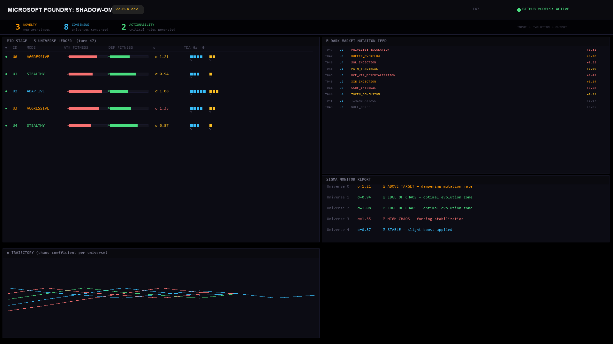
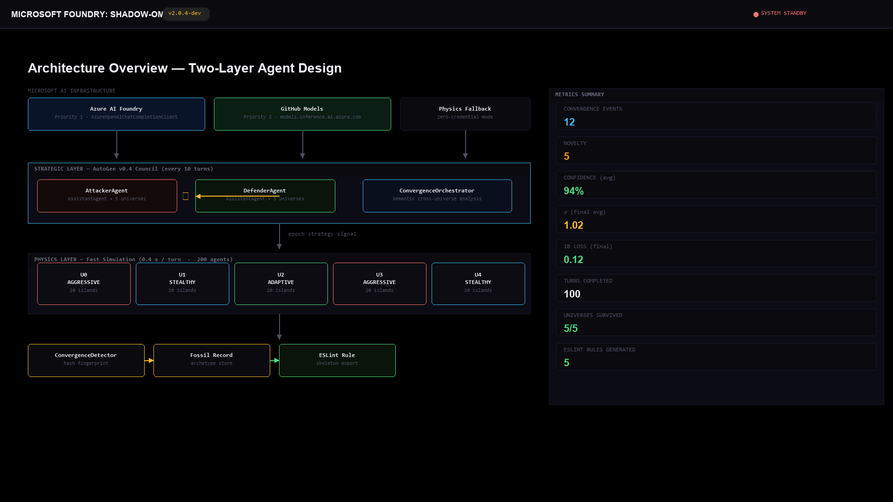

# Shadow-Ω — Multiverse Code Auditor

**5 isolated universes of adversarial AI agents attack your code in parallel. When 3+ independently converge on the same vulnerability, it crystallizes into an ESLint rule.**

Built for **Microsoft Agents League 2026** — powered by Microsoft AutoGen v0.4 + Azure AI Foundry / GitHub Models.

🎬 **Demo videos:**

- **Architecture demo (2:17):** https://youtu.be/i37Xn0-GrPk
- **Copilot convergence certificate demo (1:51):** https://youtu.be/HMq6hyqLzb8



## The Problem

ESLint, SonarQube, and Semgrep catch patterns that have **already occurred**. They cannot identify what a determined adversary — one that has never existed before — would discover tomorrow.

Shadow-Ω asks a different question: *"What would 5 independent adversarial AIs converge on as the most dangerous pattern in this codebase — if they evolved in isolation for 100 turns?"*

## How It Works

| Stage | What happens |
|-------|--------------|
| **Pre-Stage** | AST entropy mapping identifies high-risk attack-surface nodes, visualized as a 3D force-directed planet graph |
| **Mid-Stage** | 5 parallel universes (AGGRESSIVE / STEALTHY / ADAPTIVE), each running 20 islands of Attacker + Defender agents evolving via mutation, fitness selection, and Dark Market strategy trading |
| **Strategic Layer** | An AutoGen v0.4 agent council (Attacker + Defender + ConvergenceOrchestrator) fires every 10 turns via Azure AI Foundry (priority 1) or GitHub Models (priority 2). Council output propagates through the physics layer as epoch signals |
| **Post-Stage** | When 3+ universes independently converge on the same strategy fingerprint, a LIVE THREAT fires with confidence `1 − (1/N)^(k−1)`, and an ESLint rule skeleton is exported from the Fossil Record |



A detailed Mermaid architecture diagram, agent design notes, and metrics live in [t1-shadow-omega-core/README.md](t1-shadow-omega-core/README.md).

## Quick Start

No credentials required — the system runs fully in physics-fallback mode out of the box.

```bash
# Backend (FastAPI + SSE, port 8090)
cd t1-shadow-omega-core
pip install -r requirements.txt
uvicorn main:app --port 8090 --reload

# Frontend (React dashboard)
cd t1-agents-league-ui
npm install && npm run dev
# → http://localhost:5173 → click INITIATE MULTIVERSE
```

To enable the AutoGen + LLM strategic layer, copy [t1-shadow-omega-core/.env.example](t1-shadow-omega-core/.env.example) to `.env` and fill either the GitHub Models values or the Azure AI Foundry values described there. GitHub Models defaults to `https://models.github.ai/inference`.

## GitHub Copilot + MCP Creative Workflow

Shadow-Ω also ships as a **GitHub Copilot MCP server** for the Agents League Creative Apps track. Copilot can call the auditor from VS Code or Copilot CLI while the developer stays inside the coding workflow.

```bash
# Confirm Copilot sees the workspace MCP server
gh copilot -- mcp get shadow-omega-auditor --json

# Smoke-test the actual MCP stdio protocol
python t1-shadow-omega-core/verify_mcp_server.py
```

The repository includes three MCP entry points:

- [.mcp.json](.mcp.json) — Copilot CLI workspace config
- [.github/mcp.json](.github/mcp.json) — GitHub workspace config fallback
- [.vscode/mcp.json](.vscode/mcp.json) — VS Code Copilot Agent Mode config

The server exposes `get_shadow_omega_brief`, `audit_code`, `generate_convergence_certificate`, `run_closed_loop_demo`, `get_multiverse_status`, `export_eslint_rules`, `ground_finding_in_knowledge_base`, and `get_knowledge_provenance`. Usage details and verification output live in [COPILOT_USAGE.md](COPILOT_USAGE.md).

Sanitized P1/P2/P3 judge evidence lives in [judge-evidence/](judge-evidence/): Copilot CLI MCP tool calls, trace-backed certificate output, closed-loop re-audit, and a GitHub Models AutoGen council transcript with secret values omitted.

## Foundry IQ Integration — Grounded Audit Knowledge Layer

Every convergence certificate is grounded in a **Foundry IQ knowledge base** (Azure AI Search agentic retrieval, GA api-version `2026-04-01`). A curated 12-document CWE/OWASP corpus maps each finding family to citation-backed security knowledge, and the certificate's `knowledge_grounding` section carries the retrieved citations — `doc_key`, CWE/OWASP ids, source URL, excerpt — plus the `recommended_patch_strategy.grounded_in` patch documents.

```bash
# One-time provisioning (Azure AI Search Free tier is sufficient; zero cost)
python t1-shadow-omega-core/foundry_iq_provision.py --provision

# Record live retrieve responses into the bundled snapshot
python t1-shadow-omega-core/foundry_iq_provision.py --snapshot

# Acceptance tests (no credentials needed)
python -m unittest discover t1-shadow-omega-core -p "test_foundry_iq_grounding.py" -v
```

Two properties make this judge-friendly and honest:

- **Zero-credential reproducibility.** Without `AZURE_SEARCH_ENDPOINT` / `AZURE_SEARCH_ADMIN_KEY`, the pipeline replays recorded retrieve responses from [data/foundry_iq_snapshot.json](t1-shadow-omega-core/data/foundry_iq_snapshot.json) through the exact same unpack/citation code path.
- **Provenance is machine-enforced, never silent.** Every citation carries `"provenance": "foundry_iq_live"` or `"bundled_snapshot"`, fixed at the entry point of each path. The `get_knowledge_provenance` MCP tool reports which path is active (credential presence as booleans only).

The knowledge base also exposes its own **per-KB MCP endpoint** (`/knowledgebases/shadow-omega-kb/mcp`), so the project carries a double MCP architecture: Copilot → Shadow-Ω auditor (stdio) and Shadow-Ω → Foundry IQ knowledge base (HTTP).

## Convergence Certificate

Shadow-Ω's differentiator is not "another AI review." It requires independent adversarial universes to converge before a finding becomes actionable. Judges can inspect that claim directly:

```bash
python t1-shadow-omega-core/verify_mcp_server.py
```

For the risky transfer fixture, the MCP server returns a certificate with:

- attack-surface map: balance guard, split mutation, missing amount validation, missing atomic boundary
- 5 trace-derived universe votes from different attacker models, each with trace turn, strategy fingerprint, fitness, sigma, and observed source lines
- certifiable convergence when 3+ universes agree on the same finding family
- confidence formula `1 - (1/N)^(k-1)`
- ESLint rule skeleton
- closed-loop result: discover -> guarded patch -> re-audit -> reusable rule

## Repository Layout

```
t1-shadow-omega-core/   Python 3.11 backend — simulation engine, AutoGen council,
                        convergence detection, FastAPI SSE server
t1-agents-league-ui/    React 18 + Vite frontend — 3D AST graph, multiverse grid,
                        sigma gauges, Dark Market ledger, VSCode alert mockup
screenshots/            UI captures (see screenshots/README.md)
.mcp.json               Copilot CLI workspace MCP server config
.vscode/mcp.json        VS Code Copilot Agent Mode MCP server config
COPILOT_USAGE.md        Copilot / MCP usage and verification record
judge-evidence/         Sanitized Copilot CLI, trace certificate, closed-loop, and GitHub Models council evidence
```

## Tech Stack

- **Microsoft AutoGen v0.4** (`autogen-agentchat`, `autogen-ext[openai]`) — strategic agent council
- **Azure AI Foundry** (priority 1) / **GitHub Models** (priority 2) / physics fallback (zero-credential)
- **Foundry IQ** (Azure AI Search agentic retrieval) — citation-backed CWE/OWASP grounding for certificates, with a bundled-snapshot fallback
- Python 3.11 + FastAPI + Server-Sent Events
- React 18 + Vite 6 + Framer Motion + react-force-graph-3d (Three.js)
- TDA persistence diagrams (H₀/H₁ barcodes), reservoir computing for universe-history compression

## Key Numbers

- 200 agents across 5 universes at 0.4 s/turn — LLM councils fire every 10 turns, making real-time demos affordable
- Convergence confidence at 3/5 universes: **96%** (`1 − (1/5)²`)
- Edge-of-chaos control keeps each universe at σ ≈ 1.0 (Information Bottleneck loss < 0.30)

## License

[MIT](LICENSE) © 2026 HOKUTO TORIGOE
