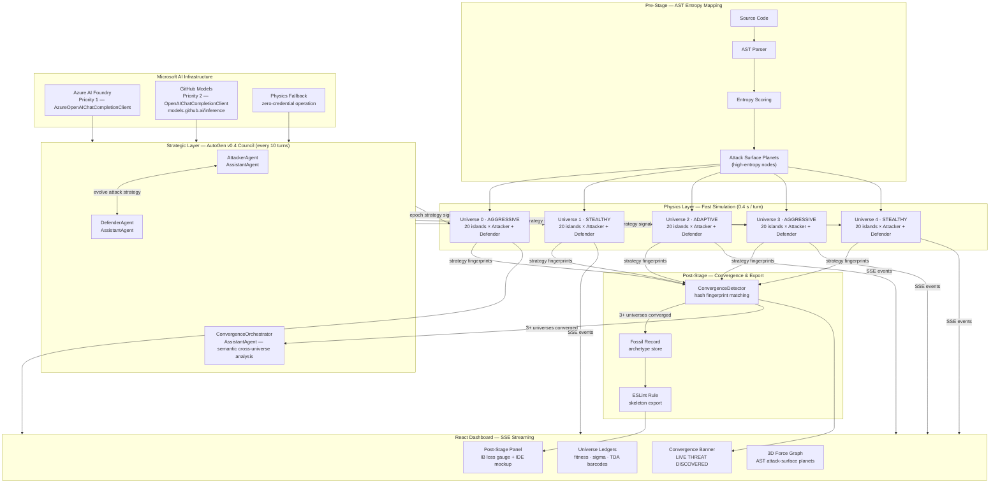

# Shadow-Ω — Multiverse Code Auditor

> **Microsoft Agents League — Reasoning Agents Track**
> Autonomous multi-agent pipeline built on **Microsoft AutoGen v0.4 + Azure AI Foundry** that hunts emergent vulnerabilities by running code through 5 parallel "universes" of attacker/defender agents, then crystallizes their collective intelligence into ESLint rules.

---

## The Problem

Static analysis tools (ESLint, SonarQube, Semgrep) catch known patterns — they describe bugs that have already happened. They cannot identify *emergent* vulnerabilities: subtle logic paths that only become exploitable under specific attacker strategies discovered through adversarial simulation.

**Shadow-Ω answers: what would 5 independent adversarial AIs converge on as the most dangerous pattern in this codebase — if they evolved in isolation for 100 turns?**

---

## Architecture

```
┌─────────────────────────────────────────────────────────────────┐
│  PRE-STAGE         MID-STAGE              POST-STAGE            │
│                                                                  │
│  Source Code  →  5 Universe Sim  →  Convergence Detection  →    │
│  AST Entropy     Attacker/Defender   Strategy Fingerprint        │
│  Mapping         Co-Evolution        ESLint Rule Export          │
│  (Force Graph)   Dark Market         Fossil Record               │
└─────────────────────────────────────────────────────────────────┘
```



### Pre-Stage — AST Entropy Mapping
- Parses the target source code into an AST (Abstract Syntax Tree)
- Computes topological entropy across nodes (σ — chaos coefficient)
- High-entropy nodes become "attack surface planets" injected into each universe
- Visualized as a 3D force-directed graph

### Mid-Stage — 5-Universe Agent Simulation
Each universe runs an **independent** ecosystem of agents:

| Agent Type | Role |
|------------|------|
| **Attacker** | Learns exploit strategies via mutation + fitness selection |
| **Defender** | Evolves countermeasures in response |
| **Oracle** | Reads academic security papers from DarkMarket, injects knowledge |
| **Sigma Monitor** | Tracks σ (chaos) — keeps universes at the "edge of chaos" |
| **Cascade** | Detects chain-infection events across universe boundaries |

Universes evolve **independently** to maximize strategy diversity, then undergo **coalition attacks** when Jensen-Shannon divergence between attacker populations aligns.

### Post-Stage — Convergence Detection
- **Strategy fingerprinting**: stable behavioral signature extracted from each agent (excluding noise parameters)
- **ConvergenceDetector**: fires when 3+ universes independently arrive at the same fingerprint in the same turn
- **Confidence formula**: `1.0 - (1.0 / N)^(k-1)` where N = total universes, k = converged count
- **Severity**: `turn ≤ 20` → medium / `turn ≤ 60` → high / `turn > 60` → critical
- **Fossil Record**: persists each unique convergence as a named archetype → auto-generates an ESLint rule skeleton

---

## Microsoft AI Foundry Integration

Shadow-Ω is built on the **Reasoning Agents** track: all strategic intelligence runs through **Microsoft AutoGen v0.4** backed by **Microsoft AI infrastructure** (Azure AI Foundry as Priority 1, GitHub Models as Priority 2 — see Setup).

### Two-Layer Agent Architecture

```
┌─────────────────────────────────────────────────────────────────────┐
│  STRATEGIC LAYER (AutoGen v0.4 — every 10 turns)                   │
│                                                                      │
│  Per-Universe Agent Councils (×5)     Cross-Universe Orchestrator   │
│  ┌─────────────────────────────┐      ┌────────────────────────────┐│
│  │ AttackerAgent (AssistantAgent)│    │ ConvergenceOrchestrator    ││
│  │   → proposes evolved attack  │    │  → semantic convergence     ││
│  │ DefenderAgent (AssistantAgent)│   │    detection across all 5   ││
│  │   → counters with defense    │    │    universes (LLM reasoning) ││
│  └──────────────┬──────────────┘    └────────────────────────────┘│
│                 │ StrategyOutput                                      │
│                 ▼                                                     │
│  Top-5 attackers per universe receive directional parameters         │
└─────────────────────────────────────────────────────────────────────┘
         │ every turn (0.4s/turn)
┌─────────────────────────────────────────────────────────────────────┐
│  PHYSICS LAYER (fast simulation — every turn)                       │
│  200 agents × mutation × fitness selection × migration × coalition  │
│  Battle adjudication: Azure OpenAI (cached) → physics fallback       │
└─────────────────────────────────────────────────────────────────────┘
```

**Design rationale**: LLM inference is expensive at 200-agent speed (0.4s/turn). The two-layer design runs the AutoGen council every 10 turns as a strategic "epoch signal" — each council output provides evolved strategy direction that propagates through the fast physics simulation for the next 10 turns. This makes real-time demos feasible while maximizing Microsoft AI Foundry impact.

### AutoGen Agents

| Agent | Class | Purpose |
|-------|-------|---------|
| `attacker_u0..4` | `AssistantAgent` | Propose DNA-aware attack strategy per universe |
| `defender_u0..4` | `AssistantAgent` | Counter-propose defensive configuration |
| `convergence_orchestrator` | `AssistantAgent` | Detect semantic equivalence across 5 universes |

Agents use `AzureOpenAIChatCompletionClient` (Azure AI Foundry) or `OpenAIChatCompletionClient` (GitHub Models) via Microsoft AI infrastructure. GitHub Models defaults to the current `https://models.github.ai/inference` endpoint and can be overridden with `GITHUB_MODELS_BASE_URL`. Priority resolution: **Azure AI Foundry → GitHub Models → physics-deterministic fallback**. The system runs fully without any credentials.

## Agent Design (Multi-Agent Protocol)

Shadow-Ω implements a structured **multi-agent coordination protocol** across 5 parallel universes:

```
Universe 0 (AGGRESSIVE)  ─┐                      AutoGen Council ─┐
Universe 1 (STEALTHY)    ─┤  ConvergenceDetector  →  ESLint Rule  │
Universe 2 (ADAPTIVE)    ─┼─►  (hash + LLM semantic  (Fossil Record)│
Universe 3 (AGGRESSIVE)  ─┤   convergence)                         │
Universe 4 (STEALTHY)    ─┘                      ←─────────────────┘
                                           Orchestrator (cross-universe)
```

**Key agent capabilities:**
- **AutoGen Councils**: Every 10 turns, per-universe Attacker+Defender dialogue via Azure OpenAI evolves strategic direction
- **Semantic Convergence**: `ConvergenceOrchestratorAgent` detects strategies with equivalent *intent* even when hash fingerprints differ
- **Mutation**: Each turn, agents randomly mutate 1-3 strategy parameters
- **Reservoir Computing**: Echo-state network compresses universe history into fixed-size readout vectors
- **TDA Analysis**: Persistent homology (H₀ = cluster count, H₁ = loop count) of attacker fitness landscapes
- **LLM Battle Judge**: Azure OpenAI evaluates attacker payloads (cached, 80%+ hit rate after warmup)
- **Direction Convergence**: Cosine similarity across strategy gradient vectors detects coordinated evolution

---

## Live Demo

The React frontend streams real-time events via **Server-Sent Events (SSE)**:

- **Pre-Stage panel**: 3D AST force graph (120 nodes, live scanning overlay)
- **Mid-Stage panel**: 5-universe ledger with fitness, σ, TDA barcode per universe
- **Dark Market ticker**: Real-time mutation trade feed
- **Convergence banner**: Full-screen alert with fingerprint + severity when convergence fires
- **Post-Stage panel**: Information Bottleneck loss gauge + VSCode mockup showing live ESLint feedback
- **Dimensional Evolution**: σ trajectory charts per universe

---

## Setup

### Backend

```bash
cd t1-shadow-omega-core
pip install -r requirements.txt
uvicorn main:app --port 8090 --reload
```

### GitHub Copilot MCP Server

From the repository root:

```bash
gh copilot -- mcp get shadow-omega-auditor --json
python t1-shadow-omega-core/verify_mcp_server.py
```

The root `.mcp.json` registers `shadow-omega-auditor` as a stdio MCP server for Copilot CLI. The root `.vscode/mcp.json` registers the same server for VS Code Copilot Agent Mode. Copilot can call `audit_code`, `get_multiverse_status`, and `export_eslint_rules` to turn selected source code into multiverse audit signals and ESLint rule drafts.

For judge-repeatable proof without starting the live backend, Copilot can call `generate_convergence_certificate` and `run_closed_loop_demo`. These tools return the attack-surface map, trace-derived independent universe votes, confidence score, guarded patch, after-patch re-audit result, and ESLint skeleton for the fixture in `demo/fixtures/risky-transfer.js`.

The repository also includes a sanitized judge evidence bundle in `judge-evidence/`: Copilot CLI MCP tool-call evidence, `simulation_trace_hybrid` certificate output, closed-loop re-audit output, and a GitHub Models AutoGen council transcript generated through `https://models.github.ai/inference` with credential values omitted.

### Frontend

```bash
cd t1-agents-league-ui
npm install
npm run dev
# → http://localhost:5173
```

### Run the Simulation

1. Open `http://localhost:5173`
2. Click **INITIATE MULTIVERSE**
3. Watch 5 universes evolve in real time
4. Convergence events fire when 3+ universes independently discover the same attack strategy
5. Each convergence event exports an ESLint rule skeleton to the Archetype panel

---

### AI Configuration

Shadow-Ω supports two credential options (or runs without any credentials):

**Option A — GitHub Models (recommended for demo, free with any GitHub account):**
```bash
cp t1-shadow-omega-core/.env.example t1-shadow-omega-core/.env
# Edit .env: set GITHUB_TOKEN to a GitHub Personal Access Token
# Generate at: github.com/settings/tokens → Generate new token (classic)
# Use GITHUB_MODEL=openai/gpt-4o-mini and GITHUB_MODELS_BASE_URL=https://models.github.ai/inference
# Fine-grained PATs / GitHub App tokens require models:read
```

**Option B — Azure AI Foundry (production / Reasoning Agents track full compliance):**
```bash
cp t1-shadow-omega-core/.env.example t1-shadow-omega-core/.env
# Edit .env: set AZURE_OPENAI_ENDPOINT and AZURE_OPENAI_KEY
# Obtain from: Azure Portal → your Azure OpenAI resource → Keys and Endpoint
```

**No credentials:** Shadow-Ω runs in full physics-fallback mode — all 200 agents, SSE streaming, and the React UI remain fully functional.

## Technical Stack

| Layer | Technology |
|-------|-----------|
| Agent Framework | **Microsoft AutoGen v0.4** (`autogen-agentchat` + `autogen-ext[openai]`) |
| AI Backend | **Azure AI Foundry** (Priority 1) or **GitHub Models** (Priority 2, free) |
| Backend | Python 3.11 + FastAPI + SSE (port 8090) |
| Simulation | 200-agent physics engine — 5 universes × 20 islands × 2 roles |
| Topology | TDA via persistence diagrams (gudhi-style) |
| Frontend | React 18 + Vite 6 + Framer Motion |
| 3D Graph | react-force-graph-3d (Three.js) |
| Charts | Recharts |

---

## What Makes This Novel

1. **Emergent consensus over static rules**: ESLint rules are *discovered* by adversarial agents, not hand-written
2. **5-universe independence prevents overfitting**: A strategy that converges across all 5 independently-seeded ecosystems has survived diverse evolutionary pressures
3. **Edge-of-chaos tuning**: Sigma monitor keeps each universe at σ ≈ 1.0 — the critical point maximizing both stability and adaptability
4. **Fossil Record**: All converged strategies are permanently stored, enabling historical comparison against new codebases
5. **Real-time observability**: Every agent action streams to the UI via SSE — full audit trail of how the vulnerability was discovered

---

## Metrics

| Metric | Description |
|--------|-------------|
| `CONVERGENCE EVENTS` | Total cross-universe fingerprint matches |
| `NOVELTY` | Unique strategy fingerprints discovered (new archetypes) |
| `CONFIDENCE` | Statistical certainty of convergence (0-100%) |
| `σ (CHAOS)` | Universe stability — edge of chaos = 1.0 |
| `IB LOSS` | Information Bottleneck deviation from chaos edge |

---

## Repository Structure

```
t1-shadow-omega-core/
├── main.py               # FastAPI SSE server (port 8090)
├── universe.py           # UniverseOrchestrator — turn runner + AutoGen council calls
├── autogen_agents.py     # Microsoft AutoGen v0.4 — UniverseAgentCouncil × 5, ConvergenceOrchestrator
├── llm_judge.py          # Azure OpenAI battle adjudication (cached)
├── universe_init.py      # 5-universe independent seeding
├── convergence_detector.py  # Cross-universe hash fingerprint matching
├── fossil_record.py      # Archetype persistence + ESLint export
├── ast_analyzer.py       # Source → entropy planets
├── sigma_monitor.py      # σ tracking + edge-of-chaos control
├── universe_cascade.py   # Chain-infection detection
├── tda_analyzer.py       # Persistent homology barcodes
├── ledger.py             # Agent budget + action history
├── oracle.py             # DarkMarket paper injection
├── reservoir.py          # Echo-state network readout
├── mutator.py            # Strategy mutation engine
├── .env.example          # Azure AI Foundry credential setup guide
└── requirements.txt      # AutoGen + Azure OpenAI + FastAPI dependencies

t1-agents-league-ui/
└── src/components/       # React UI panels
```
